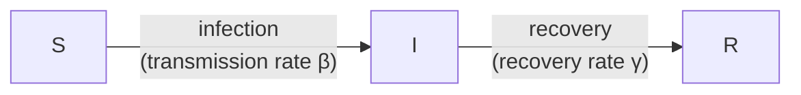

:::::::::::::::::::::::::::::::::::::: questions 

- How do you write a lesson using R Markdown and `{sandpaper}`?
- Add new question

::::::::::::::::::::::::::::::::::::::::::::::::

::::::::::::::::::::::::::::::::::::: objectives

- Explain how to use markdown with the new lesson template
- Demonstrate how to include pieces of code, figures, and nested challenge blocks

::::::::::::::::::::::::::::::::::::::::::::::::

## Introduction

This is a lesson created via The Carpentries Workbench. It is written in
[Pandoc-flavored Markdown][pandoc] for static files (with extension `.md`) and
[R Markdown][r-markdown] for dynamic files that can render code into output
(with extension `.Rmd`). Please refer to the [Introduction to The Carpentries
Workbench][carpentries-workbench] for full documentation.

What you need to know is that there are three sections required for a valid
Carpentries lesson template:

 1. `questions` are displayed at the beginning of the episode to prime the
    learner for the content.
 2. `objectives` are the learning objectives for an episode displayed with
    the questions.
 3. `keypoints` are displayed at the end of the episode to reinforce the
    objectives.

:::::::::::::::::::::::::::::::::::::::::::::::::::::::::::::::::::: instructor

Inline instructor notes can help inform instructors of timing challenges
associated with the lessons. They appear in the "Instructor View"

::::::::::::::::::::::::::::::::::::::::::::::::::::::::::::::::::::::::::::::::

::::::::::::::::::::::::::::::::::::: challenge 

## Challenge 1: Can you do it?

What is the output of this command?

```r
paste("This", "new", "lesson", "looks", "good")
```

:::::::::::::::::::::::: solution 

## Output
 
```output
[1] "This new lesson looks good"
```

:::::::::::::::::::::::::::::::::


## Challenge 2: how do you nest solutions within challenge blocks?

:::::::::::::::::::::::: solution 

You can add a line with at least three colons and a `solution` tag.

:::::::::::::::::::::::::::::::::
::::::::::::::::::::::::::::::::::::::::::::::::

## Figures

You can include figures generated from R Markdown:

```{r pyramid, fig.alt = "pie chart illusion of a pyramid", fig.cap = "Sun arise each and every morning"}
pie(
  c(Sky = 78, "Sunny side of pyramid" = 17, "Shady side of pyramid" = 5), 
  init.angle = 315, 
  col = c("deepskyblue", "yellow", "yellow3"), 
  border = FALSE
)
```
Or you can use pandoc markdown for static figures with the following syntax:

`{alt='alt text for
accessibility purposes'}`

{alt='Blue Carpentries hex person logo with no text.'}

## Math

One of our episodes contains $\LaTeX$ equations when describing how to create
dynamic reports with {knitr}, so we now use mathjax to describe this:

`$\alpha = \dfrac{1}{(1 - \beta)^2}$` becomes: $\alpha = \dfrac{1}{(1 - \beta)^2}$

Cool, right?

```{r}
library(epidemics)

uk_pop <- population(
  name = "UK population",
  contact_matrix = matrix(1),
  demography_vector = 67e6,
  initial_conditions = matrix(
    c(0.9999, 0.0001, 0, 0),
    nrow = 1, ncol = 4
  )
)

uk_pop
```




::::::::::::::::::::::::::::::::::::: keypoints 

- Use `.md` files for episodes when you want static content
- Use `.Rmd` files for episodes when you need to generate output
- Run `sandpaper::check_lesson()` to identify any issues with your lesson
- Run `sandpaper::build_lesson()` to preview your lesson locally

::::::::::::::::::::::::::::::::::::::::::::::::

